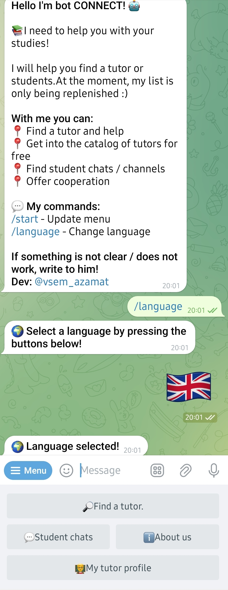
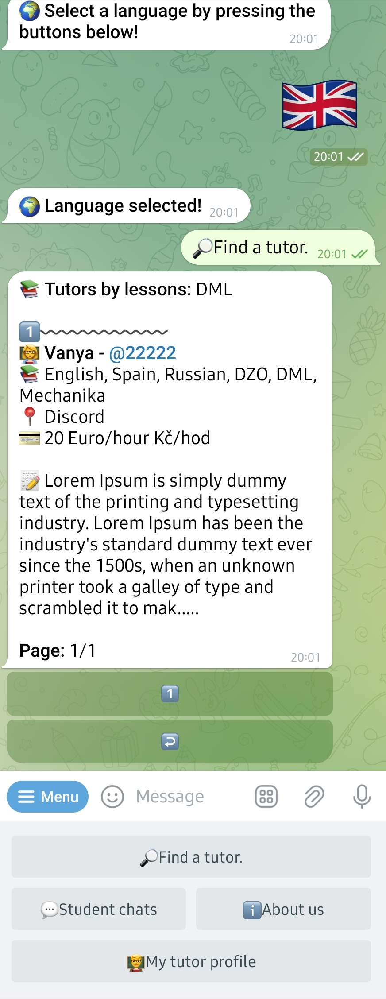
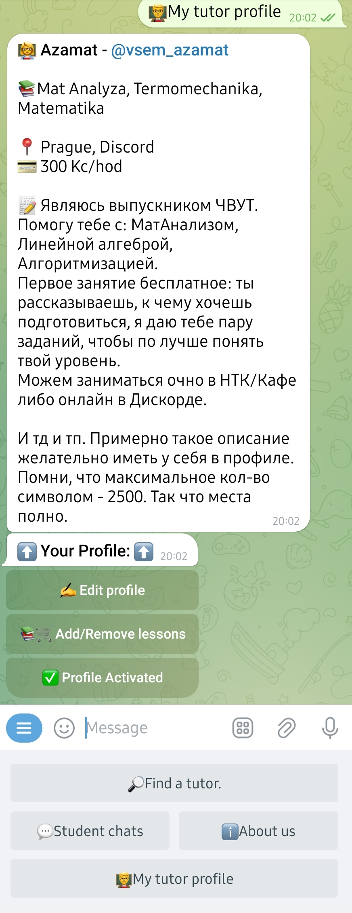
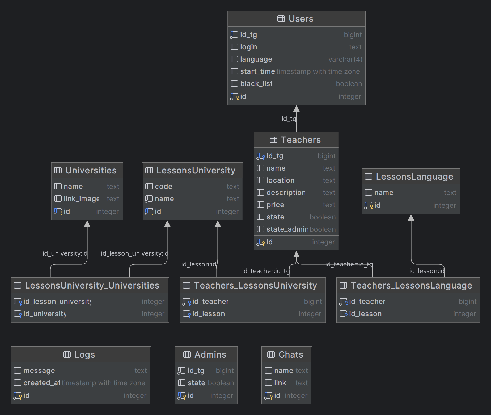

# Teachers-catalog
**Project has been created for the development of my skills in Python and DataBases.**

This bot for searching teachers and tutors in the Czech Republic. Also, if you are a teacher, you can add yourself to the database and edit your data. The bot is multilingual and supports Russian, English, Czech, Ukrainian languages. 


## Preview:
### Catalog of teachers
| Start menu | Search teachers | Teacher profile |
|:---:|:---:|:---:|
|  |  |  |

For clarity, you can watch the video:

[](https://youtu.be/jar4bUx6dJs)


### Database structure



## Contents:
- [Teachers-catalog](#teachers-catalog)
- [Preview:](#preview)
- [Contents:](#contents)
- [What is used:](#what-is-used)
- [Current and planned features:](#current-and-planned-features)
- [Installation and start](#installation-and-start)
- [Commands:](#commands)


## What is used:
- [Python3](https://www.python.org/)
- [Aiogram3](https://docs.aiogram.dev/en/latest/)
- SQL:
    - [PostgreSQL](https://www.postgresql.org/)
    - [SQLAlchemy](https://www.sqlalchemy.org/)


## Current and planned features:
### Current
- [x] Multilingualism (Russian, English, Czech, Ukrainian)
- [x] Dynamic catalog of teachers from the database
- [x] Automatic registration of teachers in the database
- [x] Teachers can independently edit their data
- [x] Search for teachers by subject name via inline mode in any chat (for example: `@teachers_catalog_bot math`)
- [x] Catalog of teachers grouping by subject, university, type of lessons

### Planned
- [ ] Dockerize the bot
- [ ] Integrate web telegram web app interface for easier bot management and user support
- [ ] Move text assets to yaml files, which will be easier to edit and automatically update the bot
- [ ] Automatic translation of teacher descriptions into user language
- [ ] Add a system of reviews and ratings for teachers
- [ ] Collect statistics on the use of the bot (clicks on buttons, commands, etc.)

## Installation and start
### Necessary:
Install requirements packages
```sh
> python3 -m venv venv
> pip install -r requirements.txt
```
Create `.env` in the `project/bot/` directory and write variables
```.env  
# Bot
BOT_TOKEN=<TOKEN>
ADMINS=<id_tg, id_tg, id_tg, ...>

# Database
DB_USERNAME=<username>
DB_PASSWORD=<password>
DB_HOST=<host>
DB_DATABASE=<database>
```

### Start:
From the root directory of the project
```sh
> python3 -m bot
```

Also, for debugging, you can use `watch.py` to automatically restart the bot when the code changes
```sh
> python3 watch.py
```

## Commands:
Prefixes: `!/`

- `/start` - Start the bot
- `/help` - Show help
- `/language` - Change language
- `/cancel` - Cancel current action

